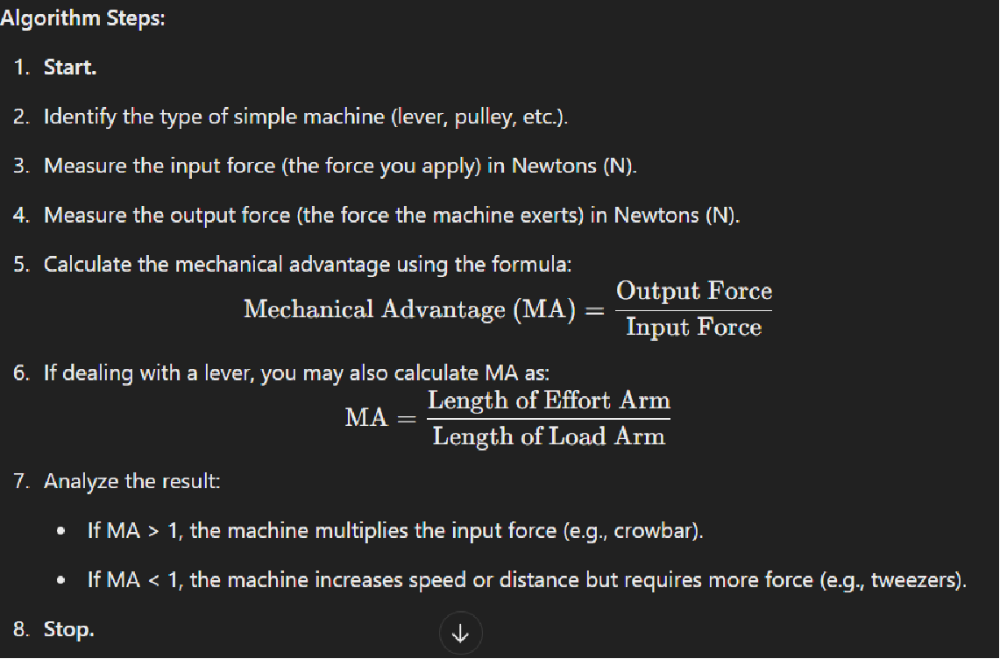
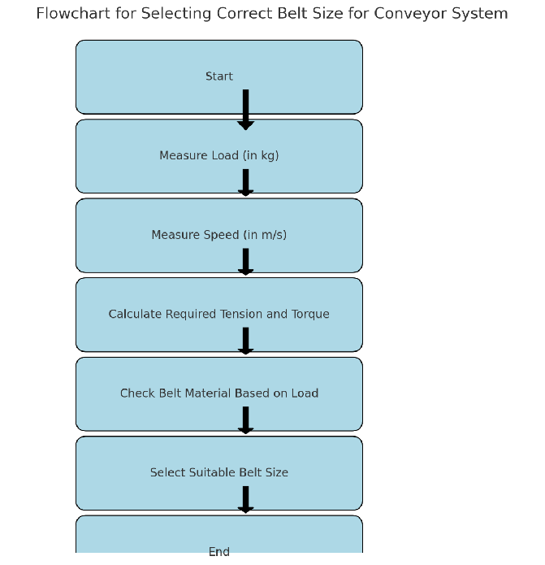

### Lecture 1: Introduction to Programming

---

#### 1. **Overview of Programming Languages**
Programming languages are tools we use to communicate with computers. Just like mechanical engineers use tools like CAD software to design parts, programming languages are used by developers to create software solutions.

- **Analogy:** Imagine building a machine. You use different tools like wrenches, drills, or CAD software depending on the task. Similarly, there are different programming languages like C++, Python, and Java designed for specific kinds of software development.
- **Types of Programming Languages:** 
  - **Low-Level Languages (e.g., Assembly):** Directly communicate with hardware. Think of it like manually operating each component of a machine.
  - **High-Level Languages (e.g., C++, Python):** Easier to use, with built-in functionalities. It’s like using automated machinery where you just press buttons instead of manually configuring every detail.

---

#### 2. **Why C/C++?**
C and C++ are fundamental programming languages widely used in systems and applications that require performance and precision, much like mechanical designs need high precision.

- **Analogy:** C++ is like a versatile CNC machine—it’s fast, powerful, and gives you detailed control over every aspect of your design. Just as a CNC machine can shape parts precisely, C++ can optimize software for speed and efficiency.
- **Mechanical Engineering Application:** C++ is commonly used in embedded systems, which are crucial in designing and controlling machines like automated assembly lines or robotic arms.

---

#### 3. **Basics of Algorithms and Flowcharts**
Algorithms are step-by-step procedures to solve problems, much like how a mechanical engineer approaches a design task—by breaking it down into logical steps.

- **Analogy:** Think of an algorithm as a blueprint for a machine. Just like a blueprint provides a step-by-step guide to constructing a part, an algorithm provides the steps needed to solve a problem.

- **Flowcharts:** Flowcharts visually represent the steps in an algorithm, similar to how a mechanical engineer would use diagrams to explain a mechanical process. Each box in a flowchart could represent a different component in a machine or a step in manufacturing.

---

#### 4. **Use of ChatGPT in Programming**
ChatGPT can be a valuable tool, similar to how simulation software helps mechanical engineers predict outcomes.

- **Analogy:** Imagine ChatGPT as your digital assistant, like a simulation tool that helps validate your designs before manufacturing. In programming, ChatGPT can:
  - Clarify complex programming concepts.
  - Generate algorithm explanations similar to how simulation software provides insights on a machine's operation.
  - Offer coding examples just like design software offers templates for mechanical components.

---